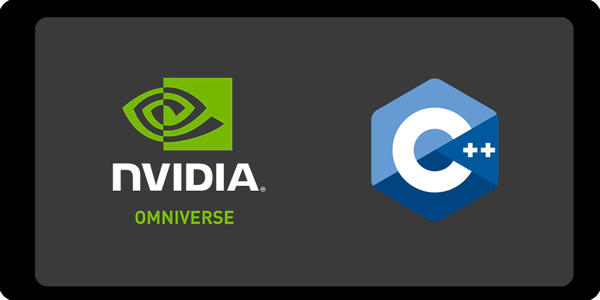

<p align="center">
    
</p>

<p align="center">
    
</p>


# OmniverseCPP

[](https://ci.appveyor.com/project/USwampertor/omniversecpp) [](./docs/MAIN.md) [](https://docs.omniverse.nvidia.com/con_connect/con_connect/overview.html?highlight=omniverse%20client%20library)


OmniverseCPP is a collection of tutorials that provide new developers, students and teachers alike a way of understanding how Nvidia Omniverse<sup>TM</sup> works with the Omniverse Client Library, the Omniverse C++ SDK, and create C++ connectors that work with the platform. Learn how Nvidia Omniverse and the Nucleus System work, understand the insides of the USD system and create new applications that can sync and be integrated into the Omniverse ecosystem.

* **[Documentation](./docs/MAIN.md)**


## Features
---

* **Learning step-by-step** - The tutorials are designed to work as small steps that anyone can understand quickly and with the ability to scale to complex Omniverse Connectors.
* **Easy setup** - Quickly set up the project and start coding! Focus on learning and creating Connectors.
* **Nvidia Omniverse endorsed** - Nvidia Omniverse has helped first-hand in the debugging testing and troubleshooting proccess of the project!


## Overview
---

The project contains a set of solutions that refer to different aspects of the Omniverse platform while working with the C++ SDK

* Connecting to the Nvidia Omniverse<sup>TM</sup> Platform and Nucleus
* How Pixar USD works
* Create, upload and get information from USD
* Syncing information in real time
* Creating connectors for custom plugins and applications

Documentation is held for information on the Omniverse SDK and the Tutorials as well.

## Getting Started
---

```
As of March 2022 the project is created with Visual Studio. 
The project is intended to work with cmake as well in the future.

```

Get the latest source code by cloning the project from Github with `git clone` or with your preferred app:

>   git clone https://github.com/USwampertor/OmniverseCPP.git

The project comes with the latest Omniverse Client Library, which you can find here:

> path/to/OmniverseCPP/OmniverseCPP/ov


This folder includes

* lib which holds all static libraries
* include which holds all .h files
* bin which includes all dynamic libraries

Each solution also has a respective Markdown file to help you understand step by step the proccess of creating the app, and the tutorials. 

**To start with the tutorials, first read the Before Starting section [HERE](./docs/Tutorials/TUTORIALS.md#before-beggining)**

## About the author
---


## Next steps
---

- [ ] Create a cmake version
- [ ] Create a Photoshop tutorial
- [ ] Create a Maya Tutorial
- [ ] Create a VPN tutorial

## Credits
---

Thanks to the Omniverse Developer Team for the help and feedback done during the creation of this tutorials.