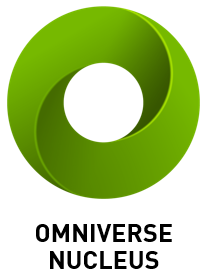

    

# Overview

This section contains the general information and basic theory of the tools you will use to start working with the Nvidia Omnvierse platform and the C++ Omniverse Client Library.

> :warning: **NOTE**:
> This project asumes that you know and have worked previously with C++. It is not intended to teach C++, but a C++ system and how it works
> I designed the tutorials in a way they are as comprehensible as they can be, so I hope that if you reading this wants to learn C++, find this helpful as well.

## Nvidia Omniverse™

    

NVIDIA Omniverse™ is an **open platform for virtual collaboration and real-time physically accurate simulation.** Creators, designers, and engineers can accelerate their workflows with **one-click interoperability between leading software tools in a shared virtual world.** Running on NVIDIA RTX™, breathtaking, high-fidelity models can be instantly shared to any device.

The platform is easily extensible and built to host a diversity of applications to create a better 3D workflow, building new tools and services that can be connected amongst each other to collaborate and iterate in the virtual space.

    

_You can find more information on Nvidia Omniverse™ in the official page **[HERE](https://www.nvidia.com/en-us/omniverse/)**_

This platform is designed for
* **Individual Creators** Omniverse revolutionizes the creative workflow by enabling real-time interoperability between top industry apps, removing the antiquated need for export/import
* **Developers** Application developers can integrate Omniverse technologies directly inside their applications or inversely, can deliver their tools and technologies to multiple DCC applications and workflows through a single platform integration.

The Omniverse platform consists of 5 key parts
* **Nucleus**: The database and collaboration engine of the Omniverse platform.
* **Connect**: The plugin system that enables client application to connect to Nucleus and interact with it.
* **Kit**: A powerful toolkit for developers to build extensions, apps, microservices and plugins for the ecosystem.
* **Simulation**: A platform created to develop physically accurate world simulations.
* **RTX Renderer**: A renderer system accelerated by RTX technology.

## Nvidia Omniverse™ Nucleus

    

Omniverse Nucleus is the heart of the collaboration system of the platform. This database and collaboration engine allows applications to share, edit and collab between applications that are connected too the platform. You can publish files to the database and subscribe to to changes that are made in real time by the connected applications.

_You can find more information on Nvidia Omniverse™ Nucleus in the official page **[HERE](https://docs.omniverse.nvidia.com/prod_nucleus/prod_nucleus/overview.html)**_

## Nvidia Omniverse™ Connect

Applications and extensions that are able to connect to the Nucleus DB and Omniverse are what Nvidia defines

_You can find more information on Nvidia Omniverse™ Connect in the official page **[HERE](https://docs.omniverse.nvidia.com/con_connect/con_connect/overview.html)**_

## Pixar USD

    

Part of the magic of Nucleus is the implementation of Pixar's open source 3D scene description and file format called **Universal Scene Descriptor** (or **USD** for short). A high performance, easily extensible format for content creation adopted in different thanks to its robust interchange between digital content creation tools. Working in the game industry, being able to collaborate in real time with other people of different teams, while being able to have a fluid working pipeline is a game changer that USD has brought upon the table of digital creation industries.

The way Nucleus works in a publis/subscribe model. Clients of the platform can publish objects and subscribe to changes in them.

 

_You can find more information on USD in the official page **[HERE](https://graphics.pixar.com/usd/release/index.html)**_

 
USD contains the information of what we could call a "Scene" (depending on the application, you may have heard some words like, scene or scenegraph or level, or map or world) that contains a list of objects that "populate" the world. We could call this a graph that can have several levels in which objects can nest or "parent" other objects (hence the name "SceneGraph"). This objects contain information that define how they look, act or react with other objects in the scene. This could be something like Geometry (to create models like houses, or characters, or a simple cube), Materials (that will show the geometry and how it looks), even Physics (will it bounce if it crashes? will it just fall into the void?). All this information is stored in the USD as a graph that lists all the objects and their properties[^1].

Nvidia Omniverse has pre-built libraries so one can access and work with USD files, either with Python or C++. For this tutorials, we will be focusing on the C++ aspect of USD.

[^1]: You could read more of this in books like 

 
